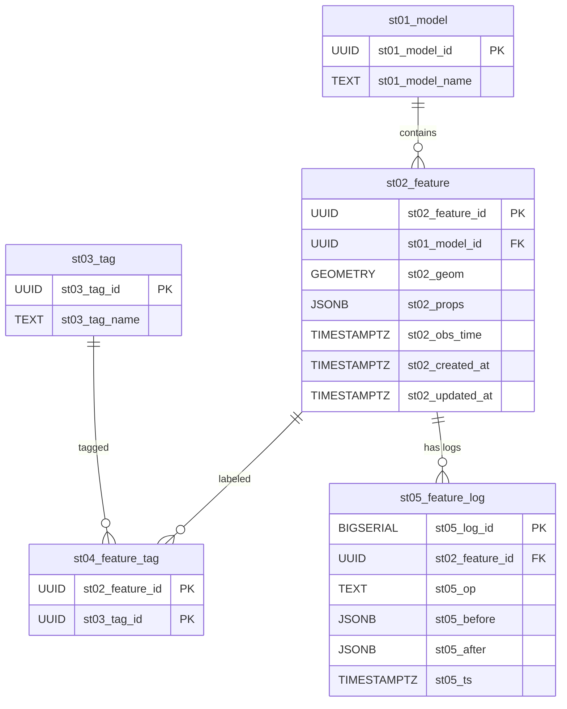

## ✅ `semantra/app` のコア目的（ビジネス視点）

1. **単なる API/UI の雛形ではない**

   - 空間情報（地物）を「意味構造体」として登録 → 検索 → 編集 →2D/3D 切替までをワンストップで回す実証。

2. **Sony の RDC_R0119 の役割に沿う強み**

   - Mapray や衛星データなど多様な GIS を「構造体化」し、意味検索可能な形で即可視化できる。

## ✅ Semantra 役割マッピング

| サービス         | 主な役割               | 主な責務                                                          | 関連ストア         | ポイント                   |
| ---------------- | ---------------------- | ----------------------------------------------------------------- | ------------------ | -------------------------- |
| **db (PostGIS)** | 真理値ストア           | 空間構造の管理（GEOMETRY）<br>意味属性（JSONB）<br>タグマスター   | PostGIS            | SRID 4326 + GIST + GIN     |
| **api**          | Command & Query API    | REST (CQRS) を提供<br>書込みは PostGIS<br>読み込みは ES + PostGIS | PostGIS + ES       | Echo / Clean Arch          |
| **sync**         | Sync Worker            | Redis Streams → ES へ非同期同期<br>Bulk Index & エラー時 DLQ      | Redis Streams + ES | Eventual Consistency       |
| **es**           | 検索ビュー             | 意味・タグ全文検索<br>複合条件の高速検索                          | Elasticsearch      | Bulk API / Single-node PoC |
| **redis**        | Event Store<br>Pub/Sub | PostGIS 変更イベントの中継<br>キャッシュ/通知にも拡張可           | Redis Streams      | Stream TTL / DLQ           |
| **web**          | Frontend BFF / UI      | Next.js App Router<br>2D/3D 地図 & 構造体編集                     | API (BFF) 経由     | MapLibre + Cesium          |
| **gate**         | API Gateway            | 外部からの入口を一元化<br>BFF/Bulk/外部 API 連携の将来性          | すべての API       | Declarative Config         |
| **bff**          | BFF 専用層             | API/Query の集約<br>認証・ユーザーコンテキスト処理                | API + Web          | Graphql                    |

---

## ✅ 物理イメージ

```plaintext
[Browser]
  ↓ HTTPS
[gate (Kong)]
  ↓ route
[bff (optional)] (Next.js API routes でも良い)
  ↓ REST/GraphQL
[api]
  ├─ Command → PostGIS → Redis Streams → [sync] → ES
  └─ Query → ES → (PostGIS for precise geom)

[sync]
  └─ Redis Streams subscribe → ES Bulk Index

[redis]
  └─ Streams, PubSub

[es]
  └─ 高速意味検索
```

---

## ✅ Semantra DB 仕様

### 🎯 **目的**

リアル空間を「意味 × 位置 × 時間軸」で捉え、
**空間検索（PostGIS）** と **意味検索（Elasticsearch）** を連携させ、
**継続的に編集・生成・配信できるデジタルツイン基盤** を OSS で実証する。

---

### ✅ **役割分担の設計**

| ストア            | 主な責務                                                                               | 技術要点                                                         |
| ----------------- | -------------------------------------------------------------------------------------- | ---------------------------------------------------------------- |
| **PostGIS**       | 地物の正確な位置情報とトポロジーを格納。BBOX、近傍、交差、包含等の厳密空間演算を担う。 | GIST インデックス、空間型 SRID:4326、一意識別子でスケール対応。  |
| **JSONB**         | 個別 Feature が持つ柔軟な属性（例：物理的属性・状態・拡張メタ）。                      | GIN インデックスで属性パス検索を高速化し、スキーマ進化に耐える。 |
| **Tag 管理**      | 多対多テーブルで柔軟にタグを付与。構造体の意味抽象化を補完し、クエリ負荷を分散。       | カーディナリティ制御により意味解像度とパフォーマンスを両立。     |
| **Elasticsearch** | 意味・タグの全文検索・複合条件検索を担当。PostGIS との整合を非同期で担保。             | Bulk API & Eventual Consistency で低レイテンシを確保。           |

---

### ✅ **テーブル概要**

| テーブル名           | 機能                                                  |
| -------------------- | ----------------------------------------------------- |
| **st01_model**       | 地物タイプをモデル化（例: building, route, landmark） |
| **st02_feature**     | 地物本体（位置＋意味属性＋時系列情報）                |
| **st03_tag**         | 意味を抽象化するラベル群（自由に追加可能）            |
| **st04_feature_tag** | Feature × Tag の多対多関連付け                        |
| **st05_feature_log** | 操作ログ（将来の差分更新・履歴追跡に備える）          |

---

### ✅ **ER 図 (論理モデル)**



---

### ✅ **設計哲学**

- **構造化 × 意味構造の二重化で耐障害性を担保**
  → PostGIS は空間構造の真理値。Elastic は意味検索の高可用キャッシュ。

- **UUID v4 によるグローバル一意性**
  → マルチリージョンでの空間・意味同期に強い。

- **履歴テーブルの標準化**
  → 将来の差分更新、Undo/Redo、オブジェクトのバージョニング管理に対応。

- **Semantic × Terra × Time 軸に拡張可能**
  → 例えばセンサデータ連携、LiDAR 点群を構造体化し履歴付きで保持。

- **Elastic とは非同期 Eventual Consistency**
  → 書込みレイテンシを抑えつつ全文検索の即時性を両立。

### 📑 Semantra API 仕様書 v0.9

_(範囲＝`api ↔ db`。Sync / BFF は対象外)_

| #   | ユースケース       | HTTP Method / Path               | 説明                                                 | 主要パラメータ                                       | リソース責務          | 戻り値(200)                     |
| --- | ------------------ | -------------------------------- | ---------------------------------------------------- | ---------------------------------------------------- | --------------------- | ------------------------------- |
| C-1 | **地物登録**       | **POST `/features`**             | GeoJSON+属性を登録し `st02_feature` を INSERT        | Body = { model, geometry, props?, tags?, obs_time? } | **Command**           | `{ id }` + 作成情報             |
| C-2 | **地物更新**       | **PATCH `/features/{id}`**       | 既存レコードを部分更新、履歴を `st05_feature_log` へ | Body = 更新フィールド                                | Command               | 更新後 JSON                     |
| C-3 | **地物削除**       | **DELETE `/features/{id}`**      | `st02_feature` 論理削除 (is_deleted) or 物理削除     |                                                      | Command               | `{ deleted: true }`             |
| C-4 | **モデル登録**     | **POST `/models`**               | `st01_model` にタイプ追加                            | Body = { name }                                      | Command               | モデル JSON                     |
| C-5 | **タグ登録**       | **POST `/tags`**                 | `st03_tag` に新規タグ追加                            | Body = { name }                                      | Command               | タグ JSON                       |
| Q-1 | **地物詳細取得**   | **GET `/features/{id}`**         | PK で取得（PostGIS）                                 | `include_history`=bool                               | **Query(DB)**         | Feature + tags (+history)       |
| Q-2 | **BBOX 空間検索**  | **GET `/features`**              | `bbox` only ⇒ PostGIS `ST_Intersects`                | `bbox=minLon,minLat,maxLon,maxLat`<br>`model?`       | Query(DB)             | GeoJSON FeatureCollection       |
| Q-3 | **意味検索**       | **GET `/search`**                | ES 全文＋タグ＋ BBOX                                 | `q=text` `tags=tag1,tag2?` `bbox?`                   | **Query(ES→DB clip)** | FeatureCollection               |
| Q-4 | **タグ一覧**       | **GET `/tags`**                  | `st03_tag` 全件                                      | `model?` フィルタ                                    | Query(DB)             | `[ { id, name } ]`              |
| Q-5 | **モデル一覧**     | **GET `/models`**                | `st01_model` 全件                                    |                                                      | Query(DB)             | `[ { id, name } ]`              |
| Q-6 | **履歴取得**       | **GET `/features/{id}/history`** | 変更履歴を時系列で返却                               | `limit?` `since?`                                    | Query(DB)             | `[ { ts, op, before, after } ]` |
| S-1 | **ヘルスチェック** | **GET `/healthz`**               | Liveness / Readiness                                 |                                                      | Infra                 | `"ok"`                          |

---
